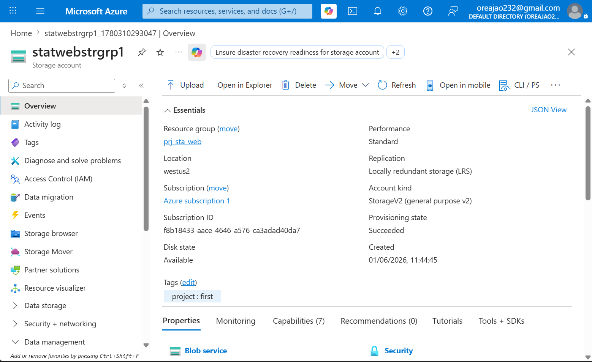
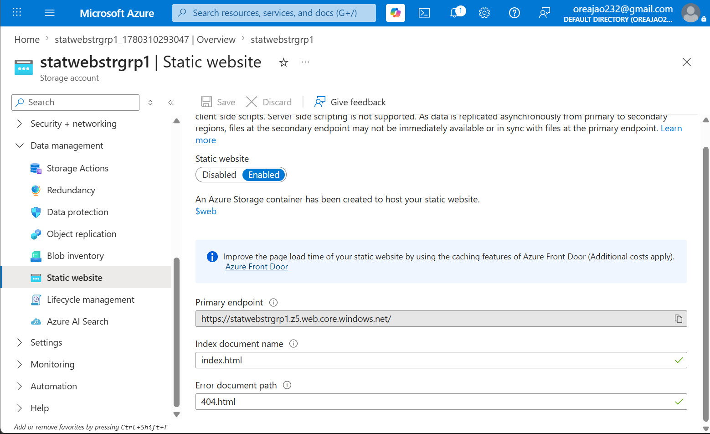
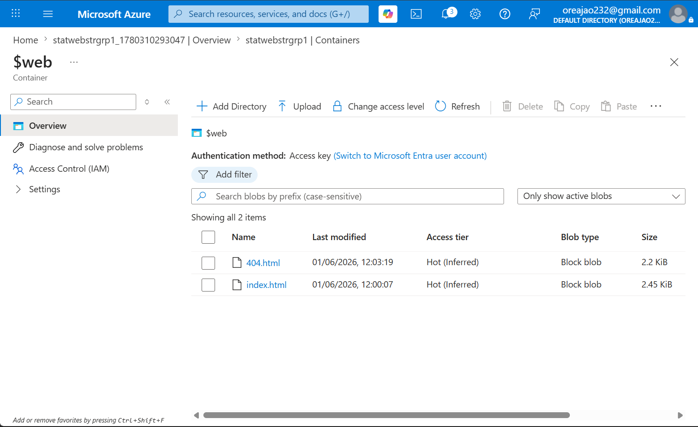
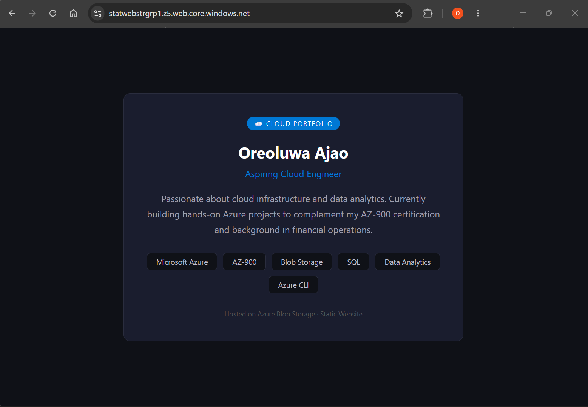
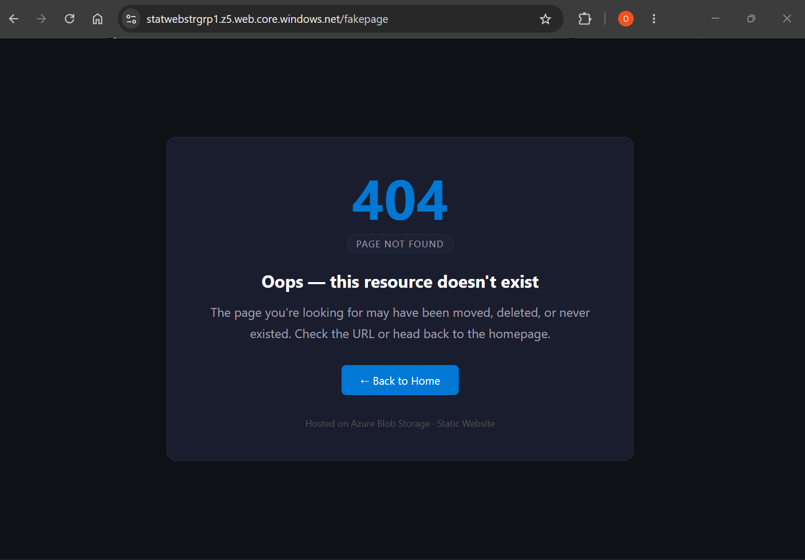

# Azure Static Website Hosting

## Overview
Project to demonstrate how to host a static website on Micrososft Azure.

## Live Site
[View Live Site](https://statwebstrgrp1.blob.core.windows.net/$web/404.html)

## Architecture
Simple diagram or description — Storage Account → Static Website → Browser

## Project Structure
azure-static-website/
├── README.md
├── website/
│   ├── index.html
│   └── 404.html
├── deployment/
│   └── deploy.sh
└── screenshots/
├── 01-storage-account-created.png
├── 02-static-website-enabled.png
├── 03-files-uploaded.png
├── 04-live-site.png
└── 05-pricing-tier.png

## Services Used
- Azure Blob Storage (Static Website feature)
- Azure Storage Explorer / CLI

## Steps to Reproduce
1. Log in to Azure Portal and create a new **Resource Group**
2. Create a **Storage Account** (choose LRS redundancy for lowest cost)
3. Navigate to **Static Website** under Data Management and enable it
4. Set `index.html` as the index document and `404.html` as the error document
5. Upload both HTML files to the `$web` container
6. Copy the primary endpoint URL — your site is now live

## Cost
| Resource | Estimated Monthly Cost |
|---|---|
| Blob Storage (LRS) | < $0.01 |
| Data Transfer | < $0.01 |
| **Total** | **~Free** |
Cost was a deliberate consideration in this architecture. Azure Blob Storage static hosting was chosen over Azure App Service or Azure Static Web Apps to minimise spend while achieving the same outcome for a simple static site.

## Screenshots
### Storage Account Created

### Static Website Enabled

### Files Uploaded

### Live Site

### Error Page

## What I Learned
- How to provision and configure Azure Storage Accounts
- How Azure's static website hosting feature works
- The importance of setting a custom error document path
- Cost-aware resource selection in Azure

## What I Would Add Next
- Custom domain name
- Azure CDN for faster global delivery
- CI/CD pipeline using GitHub Actions to auto-deploy on push
- HTTPS enforcement

## Author
**Oreoluwa Ajao**
· [GitHub](https://github.com/oresam123))
